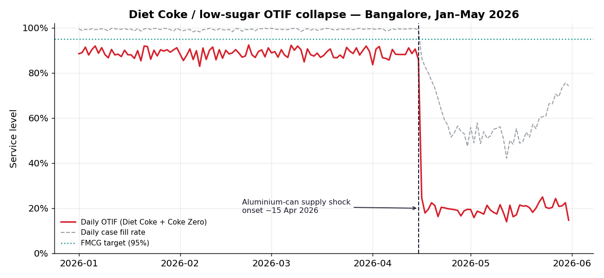
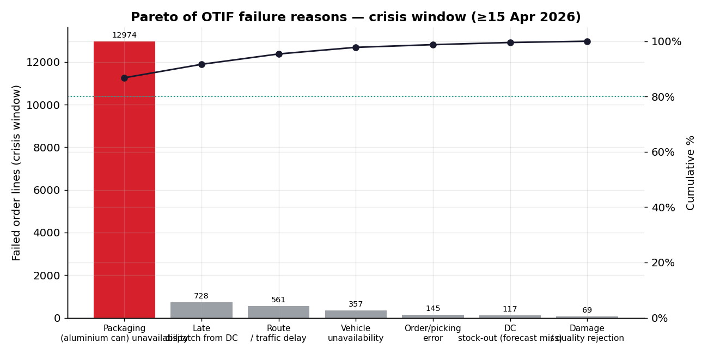
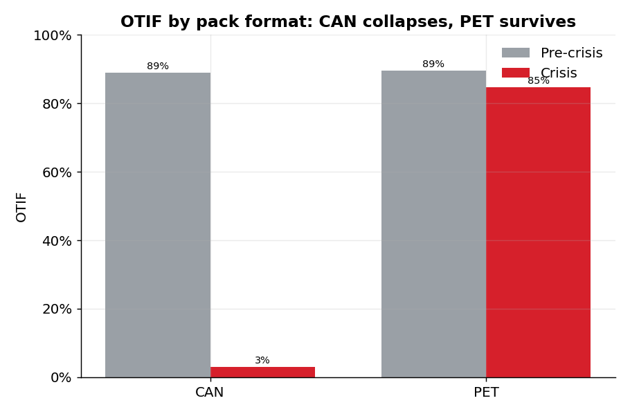
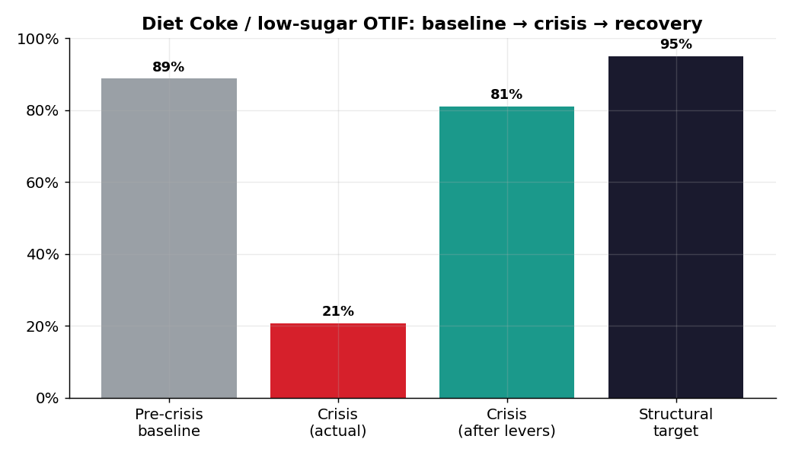

# Diet Coke Bangalore Distribution Failure — A Lean Six Sigma DMAIC Analysis

> **Reducing OTIF collapse and building packaging-supply resilience in Coca-Cola's low-sugar beverage distribution, Bangalore (Jan–May 2026).**
> A Green Belt project built around a **real, documented supply-chain failure** — the April 2026 Diet Coke aluminium-can shortage — with a transparent, simulated order-line dataset and a full Define–Measure–Analyze–Improve–Control workflow.


---

## 1. The business problem (real and recent)

From **mid-April 2026**, Diet Coke disappeared from shelves and quick-commerce apps across **Bengaluru, Mumbai, Ahmedabad, Gurugram and Pune**. The cause was *not* weak demand — it was **packaging**: a shortage of aluminium cans driven by the Strait-of-Hormuz / Gulf aluminium disruption (~9% of global aluminium output). The failure was amplified by a structural vulnerability — **Diet Coke is sold almost entirely in cans**, with minimal PET or glass presence, so a single packaging shock translated directly into a distribution collapse. Coca-Cola was reported to be **rationing supply and not fulfilling some distributor orders**. (Sources: Business Standard, Outlook Business, Reuters, Packaging South Asia — see [`docs/references.md`](docs/references.md).)

This collides with a second fact: **low-sugar is no longer niche in India.** Zero/low-sugar drinks went from ~5% of Coca-Cola India volumes (2020) to ~30% (2025), and Diet Coke volume roughly doubled year-on-year. A high-growth portfolio was left exposed to a single point of failure.

**Problem statement.** *Diet Coke / low-sugar OTIF in the Bangalore secondary-distribution network is structurally exposed to aluminium-can supply shocks. Quantify the service and margin impact of the April 2026 shortage, isolate the root cause, and design a Green-Belt-executable set of resilience interventions to restore service and protect margin.*

> ⚠️ **Data honesty.** Coca-Cola's internal distributor data is not public. The macro facts above are **real and cited**. The **order-line dataset in this repo is a calibrated simulation** (`src/generate_data.py`), engineered to reproduce the documented timeline and benchmarks — it is **not** real Coca-Cola data. This is the standard consulting approach when client data is unavailable, and every assumption is documented in [`docs/data_dictionary.md`](docs/data_dictionary.md).

---

## 2. Headline results

| Metric | Pre-crisis | Crisis (low-sugar) | After interventions |
|---|---|---|---|
| **OTIF** | 88.8% | **20.8%** | **81.1%** |
| Case fill rate | ~97% | 60.0% | — |
| Process sigma | 2.72σ | **0.69σ** (≈792k DPMO) | — |

- **One root cause dominates.** Packaging (aluminium-can) unavailability accounts for **86.8%** of all crisis OTIF failures — a textbook Pareto.
- **Pack format is the fault line.** Crisis OTIF for **CAN SKUs fell to 3%** while **PET SKUs held at ~85%** (χ² = 17,623, p < 0.001). The vulnerability is the single-format dependence, not the supply shock alone.
- **Margin at stake.** The 6-week crisis window destroyed **≈₹1.83 crore in contribution margin** (₹5.9 cr in lost revenue) on the Bangalore low-sugar portfolio.
- **Recoverable.** Three Green-Belt interventions recover **≈₹1.45 crore (80%)** of the controllable loss and lift crisis OTIF from 20.8% → **81.1%**, with a structural path back to the **95%** target.
- **Even the baseline was sub-target.** Pre-crisis OTIF (89%) was already **5.8 pp below** the 95% FMCG benchmark — a measurement-system finding before the shock even hit.



---

## 3. Approach — DMAIC

| Phase | What was done | Key artefacts |
|---|---|---|
| **Define** | Project charter, SIPOC, problem & goal statements, CTQ = OTIF | [`docs/project_charter.md`](docs/project_charter.md) |
| **Measure** | Baseline OTIF / fill rate / process sigma; segmentation; measurement-system definition | Fig 01, `results.json` |
| **Analyze** | Pareto, OTIF by pack-format / channel / SKU, χ² hypothesis test, fishbone, 5-Whys, FMEA, lost-margin bridge | Figs 02–05, 07 |
| **Improve** | Three prioritised interventions + counterfactual recovery simulation | Figs 06–07 |
| **Control** | p-chart, control plan, early-warning supply-risk dashboard | Fig 08, [`docs/control_plan.md`](docs/control_plan.md) |

**Frameworks used (and why):** Pareto (to prove one cause dominates), Fishbone + 5-Whys (to trace can OOS to single-format + single-region sourcing), **FMEA** (to rank residual supply risks), **RICE** (to prioritise interventions), and unit-economics / contribution-margin bridges (to quantify impact). Frameworks are applied only where they earn their place — rationale is given in the [DMAIC report](reports/DMAIC_Report.md).

---

## 4. Root cause & recommendations




**Root cause:** Diet Coke's ~95% dependence on a *single* packaging format (aluminium can) sourced from a *single* exposed region created a single point of failure. When can supply was shocked, there was no PET/glass fallback and no substitution playbook, so demand was lost rather than redirected.

**Prioritised interventions (RICE-ranked, see report):**

| # | Intervention | Recovers | Complexity |
|---|---|---|---|
| 1 | **Pack-format diversification** — fast-track Diet Coke 750 ml PET + 250 ml glass for Bangalore | ₹0.63 cr | Medium |
| 2 | **Dynamic substitution playbook** — auto-offer Coke Zero PET when a can SKU is OOS (esp. quick-commerce) | ₹0.45 cr | Low |
| 3 | **Strategic can buffer (4–6 wk) + qualified 2nd supplier** + early-warning index | ₹0.36 cr | Medium-High |

Combined: **≈₹1.45 cr recovered (80% of controllable loss)**, crisis OTIF 20.8% → 81.1%.



---

## 5. Repository structure

```
diet-coke-bangalore-distribution-dmaic/
├── README.md                  ← you are here
├── data/
│   ├── raw/                   orders.csv (71k lines), sku_master.csv
│   ├── processed/             aggregated DMAIC tables
│   └── README.md              data provenance & honesty note
├── src/
│   ├── generate_data.py       calibrated simulation of the crisis
│   └── analyze_dmaic.py       full DMAIC pipeline → figures + results.json
├── notebooks/
│   └── DMAIC_walkthrough.ipynb
├── reports/
│   ├── DMAIC_Report.md        full 18-section report
│   ├── results.json           every headline number, machine-readable
│   └── figures/               8 publication-style charts
├── dashboards/
│   └── otif_dashboard.html    self-contained interactive dashboard
├── presentations/
│   └── storyline.md           consulting slide-by-slide storyline
├── docs/
│   ├── project_charter.md     ├── data_dictionary.md
│   ├── control_plan.md        └── references.md (real, cited sources)
├── requirements.txt
└── LICENSE
```

---

## 6. How to reproduce

```bash
git clone https://github.com/BKPRANEETH/diet-coke-bangalore-distribution-dmaic.git
cd diet-coke-bangalore-distribution-dmaic
pip install -r requirements.txt

python src/generate_data.py      # writes data/raw/*.csv
python src/analyze_dmaic.py      # writes figures + data/processed + results.json
# open dashboards/otif_dashboard.html in a browser
```

Everything is deterministic (`SEED = 42`), so results reproduce exactly.

---

## 7. Limitations (stated honestly)

- The transactional dataset is **simulated**, not Coca-Cola's real data; magnitudes are calibrated to public benchmarks, not measured. Conclusions about *method* are robust; absolute rupee figures are **illustrative**.
- The aluminium shock is a **physical** constraint — no software fix creates cans. Interventions mitigate exposure (diversify, substitute, buffer); they do not eliminate a global commodity shock, hence the modelled 80% (not 100%) recovery ceiling.
- Recovery counterfactual assumes interventions could have been (partly) pre-positioned; in reality lead times for PET line changeovers and supplier qualification apply (addressed in the roadmap).

---

## 8. References

All real-world claims are cited in [`docs/references.md`](docs/references.md) — Business Standard, Outlook Business, Reuters (via Packaging South Asia), Open Magazine, plus OTIF benchmark sources (FourKites, MetricHQ) and unit-economics anchors (Varun Beverages disclosures).

---

## 9. Résumé / portfolio framing

> Built a Lean Six Sigma (DMAIC) supply-chain analysis of the real April-2026 Diet Coke aluminium-can shortage in Bangalore: engineered a 71k-line distribution dataset calibrated to the documented event, isolated a single root cause driving **86.8%** of OTIF failures, quantified a **₹1.83 cr** margin loss, and designed RICE-prioritised resilience interventions recovering **80%** of the loss and lifting OTIF from **20.8% → 81.1%**.

See the full résumé bullets and LinkedIn description at the bottom of [`reports/DMAIC_Report.md`](reports/DMAIC_Report.md).

---

*Built as an MBA / Lean Six Sigma Green Belt portfolio project. Methodology is real; the dataset is a transparent simulation of a real, cited event.*
